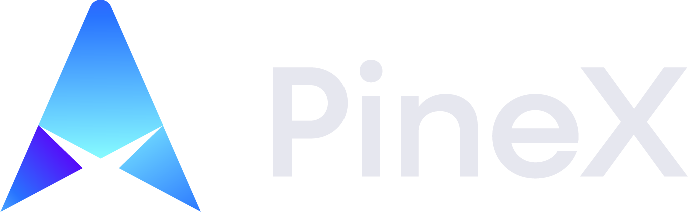
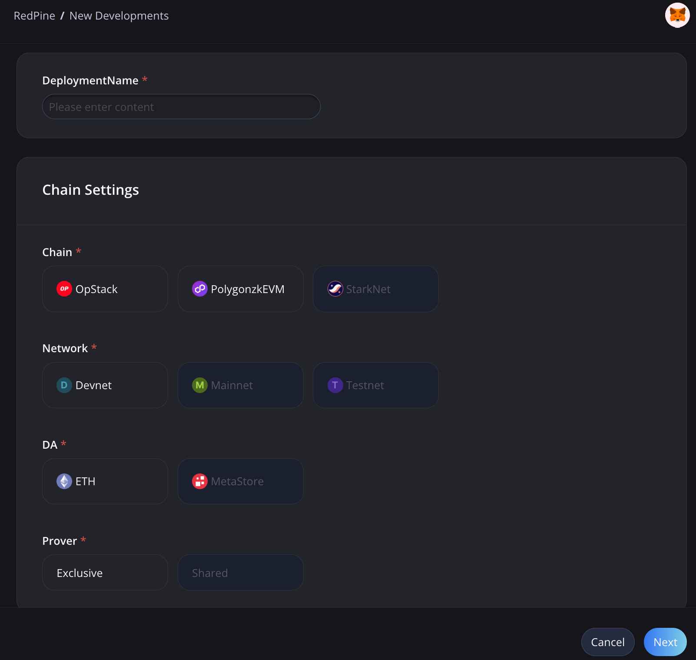
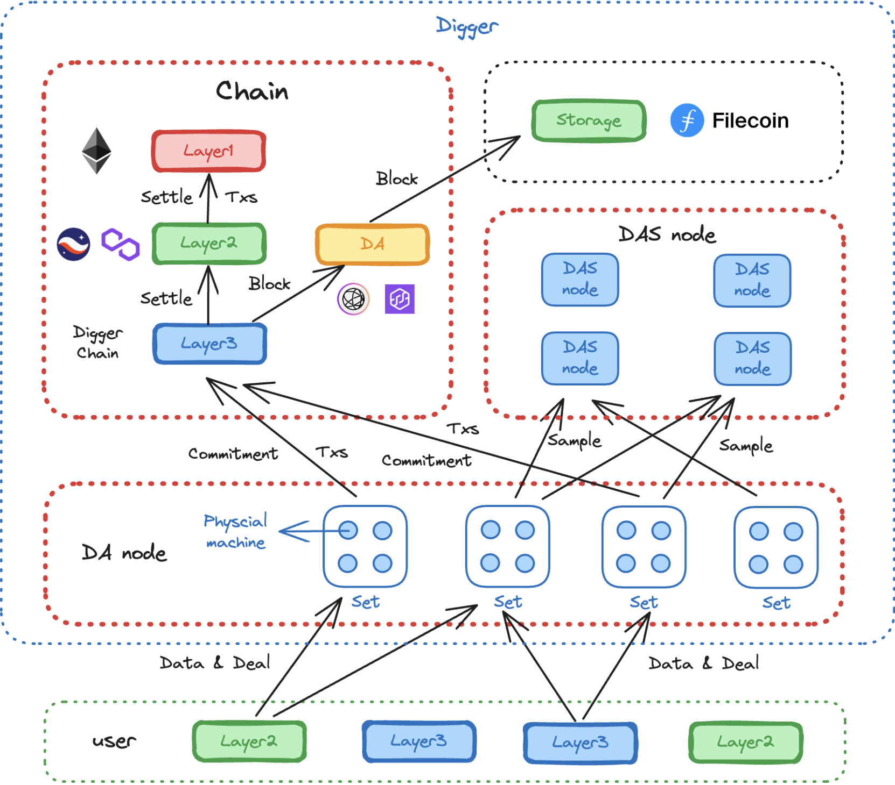

# 2023WXH-Metastore

# Pinex
PineX is a decentralized platform that provides Web3 builders with decentralized, high-performance, and cost-effective platform services.

## Introduction
PineX prioritizes offering Redpine (RaaS) and Digger (DA) platform services. In the future, more Web3-native decentralized platform services will be introduced. The goal is to allow Web3 builders to concentrate on their core business, delegating the underlying platform support to PineX. This significantly reduces the barriers for builders to enter Web3 and build dApps, driving the advancement of the entire Web3 ecosystem.

## Redpine
Redpine is a no-code deployment service for rollups. It supports the most common rollup chains, including op stack, Polygon zkevm, StarkNet, and more. It's the industry's first cloud-built, decentralized, and secure RaaS product.

## Digger
Digger is a decentralized, high-performance, and cost-effective DA service. Built on Layer 3, off-chain storage, data availability sampling, and other technologies, it boasts leading industry scalability.

# Project presentation  
- [PPT](docs/PineX.pdf)
- [Pinex Website](https://pinex.it)
- [Pinex Console](https://console.pinex.it)
- [Pinex Redpine demo](docs/redpine_demo.mov)

## Code
- [Pinex Redpine backend](src/pinex-redpine-backend/)